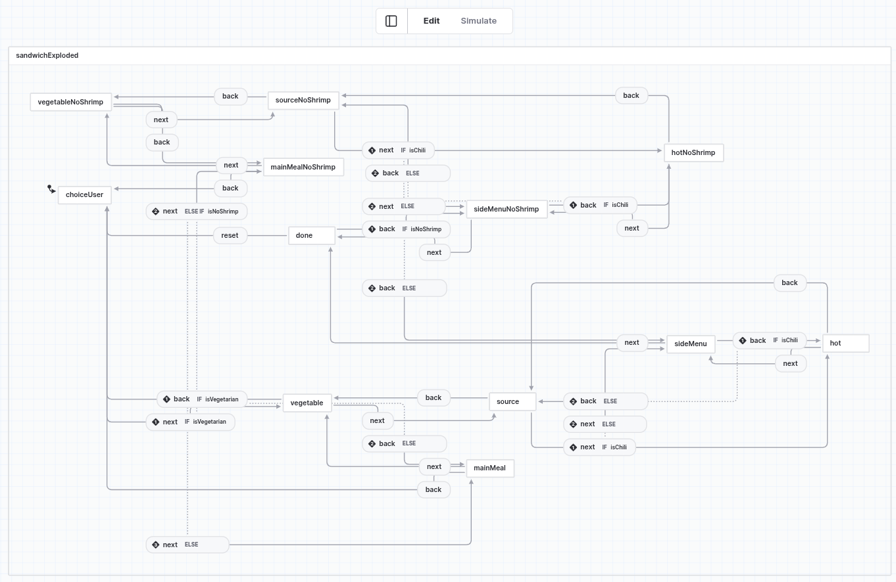
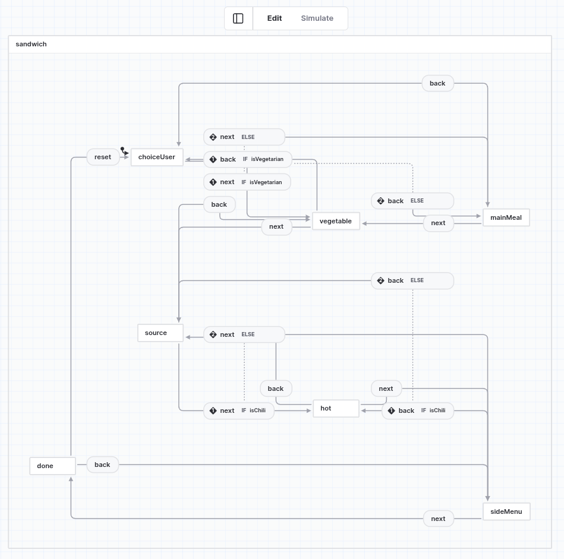

# SandwichForm — state-machine（失敗デモ）

Zenn 記事「複雑な入力フォームの設計」で紹介する失敗パターンの実装デモ

ページ遷移を xstate の state-machine で表現すると、条件付き分岐フォームでは何が破綻するかを見せるのが目的
最終的に採用した設計は [`../solution`](../solution) を参照

**デモ**: <https://wata-haru.github.io/zenn-articles/f1872707871b2c/state-machine/>

## 失敗例

時系列としては筆者は失敗1 を先に試して破綻し、失敗2 を試したがこれも良い結果にならなかった

### 失敗 1: 状態の組み合わせ爆発

対象ファイル: `src/model/machineExploded.ts` 

「選択肢の差分まで含めてすべて xstate の state で表現する」方針にしたら、表示トグル 1 つで状態が2倍に増えて組み合わせ爆発を起こした。



### 失敗 2: guard 注入方式

対象ファイル: `src/model/machine.ts`

失敗 1 を避けて「navigation だけを machine に持たせる」ようにすると、分岐フラグを formData から算出して event で注入するしかなくsource of truthではなくなった。(`next` / `back` の両方に同じ guard を書く二重管理が発生する。)



## 起動

```sh
npm ci
npm run dev
```

## ディレクトリ構造

```
src/
├── main.ts                          # Vue + Pinia を初期化してマウント
├── App.vue                          # ルート。失敗の説明を出しつつフォームを描画
├── model/
│   ├── types.ts                     # ドメイン型
│   ├── const.ts                     # 定数（値・初期値）
│   ├── machineExploded.ts           # ★失敗1: 組み合わせ爆発した state-machine
│   ├── machine.ts                   # ★失敗2: guard 注入方式の state-machine
│   └── store/
│       └── useSandwichFormStore.ts  # 入力データを持つだけの素朴な Pinia store
└── pages/
    └── SandwichForm/
        ├── container.vue            # machine と store を配線
        ├── index.vue                # presentation
        ├── sectionTitles.ts         # ページ見出しの表示辞書
        └── optionLabels.ts          # 各選択肢の表示ラベル辞書
```

## 割愛している点

- stepper: machine からは「表示すべきステップ列」を素直に導出できないため割愛
- submit 時 validation
- 「次へ」押下時の入力チェック
- リロード時のデータ永続化
