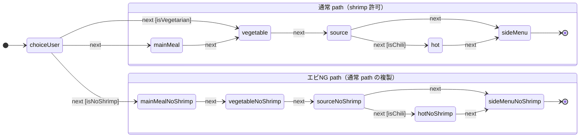

# 失敗2の遷移図（表示トグル “1つ” で path が丸ごと2倍）

`machineExploded.ts` を図にしたもの。エビNG（pattern b）を state で一意に持つと、
通常 path とエビNG path が丸ごと二重化する。

- 表示トグルが **1つ（エビNG）** なのに、後続 path が丸ごと 2 つに割れている。
- 独立した表示トグルが 1 つ増えるたびに、この path 集合がさらに ×2 されていく。
- 表示トグルが増えるほど、この掛け算で状態数が膨らみ、遷移図は読みにくくなる。
